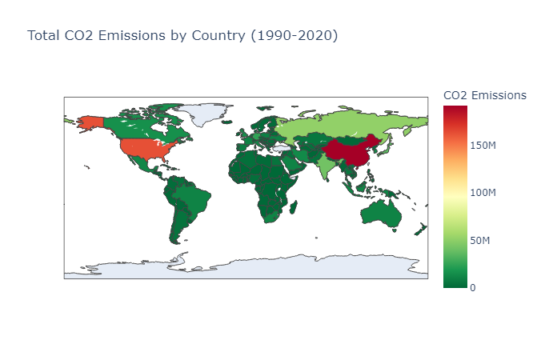
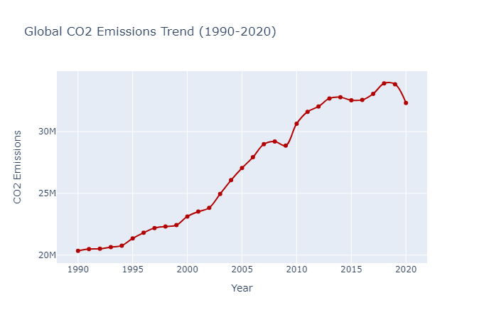
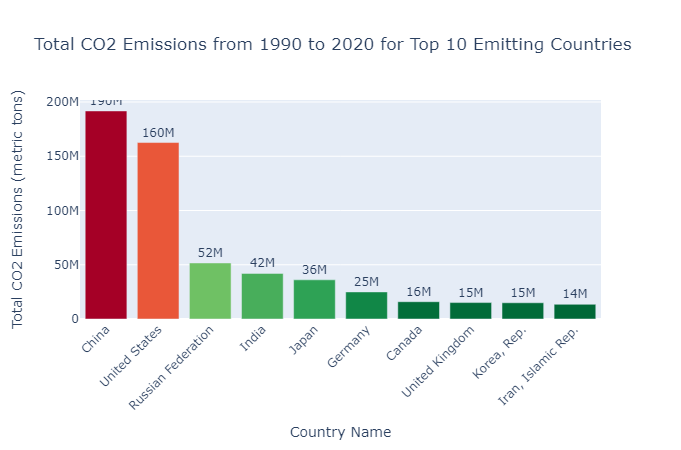
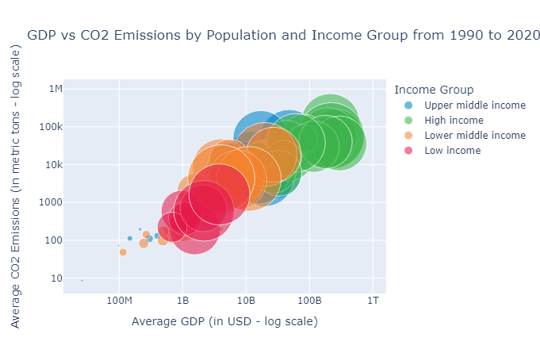
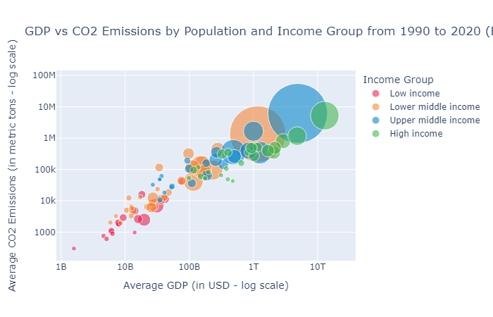
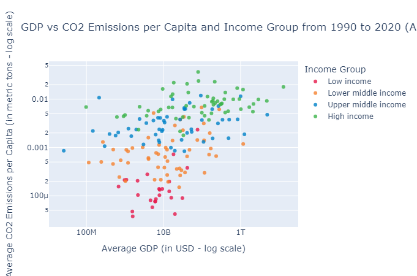
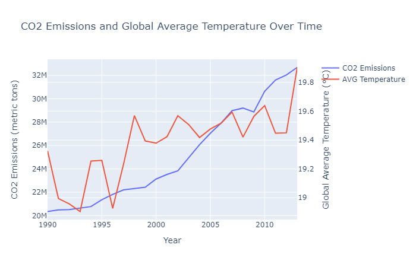

# CO2EconomyInsights
## Introduction
Welcome to CO2EconomyInsights! This project is an in-depth analysis aimed at uncovering the intricate relationships between CO2 emissions, economic activity, population growth, and temperature variations. Climate change, marked significantly by increasing CO2 emissions, is one of the most pressing issues humanity faces today. Our focus is on data spanning from 1990 to 2020, delving into the contributing factors, the varying roles of different countries and regions, and the overarching trends that define this critical period in environmental change.

Understanding the dynamics of CO2 emissions is crucial for effective policy formulation, awareness-raising, and climate action. This project offers accessible, comprehensible, and actionable insights into these dynamics.



*This world map displays CO2 emissions by country from 1990 to 2020, highlighting the global distribution and identifying major contributors*

## Project Breakdown
The primary objective is to analyze the trends and correlations between CO2 emissions and various factors like GDP, population, and temperature across different countries and regions. We aim to address the following questions:
1. **Global CO2 Emissions Trends (1990-2020)**: A line graph visualizing the yearly global CO2 emissions, identifying periods of increase or decrease.
2. **Geographical Distribution and Top Contributors**: An interactive global map and a bar chart showing emissions by country, highlighting major contributors.
3. **Correlation Between GDP, Population, and CO2 Emissions**: A bubble chart exploring the relationship between a country's economy, population size, and emissions.
4. **Emissions per Capita vs GDP**: A scatter plot analyzing CO2 emissions per capita against GDP to understand the impact of economic development on environmental sustainability.
5. **Temperature Changes Alongside CO2 Emissions**: A dual-axis line chart with yearly average temperatures and CO2 emissions, exploring potential correlations.

## Requirements
- Python 3.10
- Pandas
- Plotly
- Jupyter Notebook

## Project Structure
- `clean_data.py`: Script for cleaning and preprocessing the raw data.
- `main_analysis.py`: The main script that runs the analysis and generates visualizations.
- `notebook.ipynb`: Jupyter Notebook with detailed analysis and visualizations.
- `colors.py`: Script defining custom colors used in charts.
- `helper_functions.py`: Contains functions used across different scripts for data manipulation and analysis.
- `requirements.txt`: Lists all the necessary Python packages for the project.
- `data/`: Directory containing datasets.
    - `raw_data/`: Contains original datasets.
    - `clean_data/`: Contains cleaned datasets.
- `images/`: Folder with PNG files of charts used in the README.

## Get Started

### 1. Clone the Repository:
Clone the repository to your local machine using:
```bash
git clone https://github.com/Alfredomg7/CO2EconomyInsights
```

### 2. Install requirements:
Navigate to the project directory and install the required libraries:
```bash
cd CO2EconomyInsights
pip install -r requirements.txt
```

### 3. Data Cleaning:
- Navigate to the directory containing the `clean_data.py` script and run it to preprocess the datasets:
```bash
python clean_data.py
```

### 4. Running the Main Analysis:
- After cleaning the data, execute the `main_analysis.py` module to generate the Plotly charts:
```bash
python main_analysis.py
```

### 5. Exploring the Notebook:
- To delve deeper into the analysis, open and run the `notebook.ipynb` Jupyter Notebook:
```bash
jupyter notebook notebook.ipynb
```

## Notes:
- Ensure all datasets are correctly placed in the designated data directory as referenced in the scripts.
- You need internet access while running the scripts, as some libraries may fetch additional data or resources online.
- The results will be displayed directly in your Python environment or can be exported as HTML files for easy sharing and viewing.

## Visualizations

### Global CO2 Emissions Over Time


*This line graph shows the global CO2 emissions from 1990 to 2020. It reveals a clear upward trend, highlighting the increasing environmental challenge over three decades.*

### CO2 Emissions Top 10 Countries


*This bar chart presents the top 10 CO2 emitting countries from 1990 to 2020, providing insight into the largest contributors to global emissions.*

### Correlation Between GDP, Population, and CO2 Emissions



*These bubble charts for small and big countries compare average GDP with average CO2 emissions, using population size as the bubble scale. They explore the relationship between economic output, population, and emissions.*

### GDP vs CO2 Emissions per Capita


*This scatter plot analyzes the relationship between average GDP and CO2 emissions per capita, examining the impact of economic development on emissions.*

### CO2 Emissions and Global Average Temperature Correlation


*The dual-axis line chart compares global CO2 emissions with average global temperatures, illustrating the potential link between emissions and climate change.*

## Conclusion
The CO2EconomyInsights analysis has brought to light crucial insights into the intricate dynamics between CO2 emissions and various global factors. Key takeaways include the significant upward trend in global emissions over the past three decades, the diverse impact of economic growth and population on emissions, and the clear influence of emissions on global temperature rise. These findings underscore the urgency for sustainable economic policies and global cooperation to address the challenges of climate change. This project highlights the importance of integrating environmental considerations into economic and development strategies to ensure a balanced and sustainable future.

